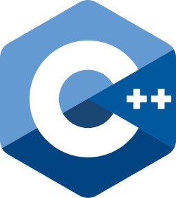

<h1 align="center" id="macropower-title">:wave: Hi! I'm Shashank</h1>

### About Me:
- 🌱 I’m currently working as ML Enginner
- :bulb: I'm interested in: CV, NLP and Rendering
- ⚡ Fun fact: I like learning languages, sé un poco de español, 日本語をべんきょうしています
- 🧑‍💻 Tech I work on include:

